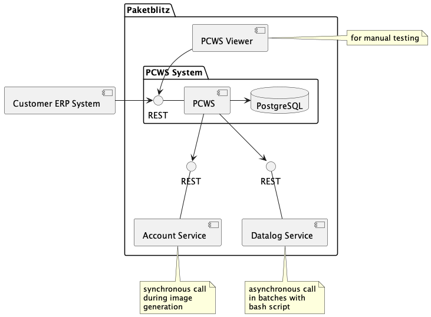

# Application Transformation Exercise

## Tasks

### Setup
- form teams of 3-4 people
  - try to make the teams cross-functional, so you have technical and business expertise in your team
- let us know who is in your team and indicate the desired time slots for your team for:
  - Milestone "Cloud Scope" (max. 1 hour after beginning the exercise)
  - Review (towards the end of the exercise, before final presentations)
  
### First Phase: Milestone "Cloud Scope" & Backlog
- define the "Cloud Scope" of your application transformation
- sketch a high-level architecture including
  - components to be transformed/migrated
  - integration and interfaces between customer systems, other Paketblitz services, and the new components in the cloud
  - required adjustments/transformations of the PC-WS application
- prepare an initial backlog for a cloud evaluation PoC: try to get the even more simplified PC-WS (see below) running on a cloud platform of your choice (you may also choose to work with containers, e.g., docker-compose or Kubernetes).
  -  feel free to add further topics as listed below
- present the items above to the lecturers during your chosen timeslot before proceeding to the next phase

### Second Phase: "Cloud Evaluation" & Review
- work on your backlog, i.e., try to get a PoC running
  - if you discover further things to be done along the way, take note of them and add them to the backlog 
- prepare a short presentation (max. 5 minutes) for your fellow students with 2-3 of the following topics:
  - learnings
  - "aha!" moments
  - observations
  - open questions
  - where did we get lucky? where not?
  - risks?
  - demo of running service
  - etc.
- prepare a brief review of the things you worked on for the lecturers and present them in your chosen timeslot (we will mainly focus on the presentation)
- send your presentation to the lecturer
  - the presentation should at least contain an architecture diagram for your target architecture on the cloud provider of your choice 

## Hints

1. Focus on getting the web service itself running first
   - PC-WS has various configuration options based on environment variables to easily mock dependencies
   - initially, you may want to work with `SPRING_PROFILES_ACTIVE` set to `mock`, this enables mocks for all external dependencies
2. Once you have the web service up and running, we recommend adding a database
   - for this, set `SPRING_PROFILES_ACTIVE`  to `real`
   - set `USE_DATALOG_SERVICE_MOCK` to `true`, this way, the datalog service part will still be mocked
   - in this profile, `USE_CODE_SERVICE_MOCK` is has default value `false`, so the database will be used for generating unique IDs
3. Finally, you can address the datalog service integration
   - set `USE_DATALOG_SERVICE_MOCK` to `false` or simply do not set this value at all (`false` is the default)

## Possible Further Topics to Work On

Based on your interests or if you have some time left over after having managed to run PC-WS, you may be interested in looking into some of the following topics:

- IT Organization, Operations, and Support including CI/CD and DevOps: How would you organize this? What needs to be done? What do we need to look out for? Principles? Guidelines? Technical aspects?
- TCO Analysis including a closer look at the business case: Calculate/estimate the cost of different variants. What kind of investements are justified? (You may want to combine this with the question below)
- Transformation Estimation including a detailled analysis of the initial transformation: What steps are necessary? What is the required engineering effort?
- The Far Future: Where could the cloud journey lead to? What are some new opportunities we gain after the initial transformation? What further optimizations or even new business cases would be possible?

## PC-WS

#### Components

#### Processes

### The Services

- PrintCode Web Service: https://github.com/SamuelBucheliZ/bfh-pcws
  - Live demo with mocked external systems at  https://bfh-pcws-mock.herokuapp.com/swagger-ui.html
- Viewer: https://github.com/SamuelBucheliZ/bfh-pcws-viewer 
  - Live at https://samuelbucheliz.github.io/bfh-pcws-viewer/
- Paketblitz Account Service: https://github.com/SamuelBucheliZ/bfh-paketblitz-account-service
  - Live at https://bfh-paketblitz-account-service.herokuapp.com/swagger-ui.html
- Paketblitz Datalog Service: https://github.com/SamuelBucheliZ/bfh-paketblitz-datalog-service
  - Live at https://bfh-paketblitz-datalog-service.herokuapp.com/swagger-ui.html
